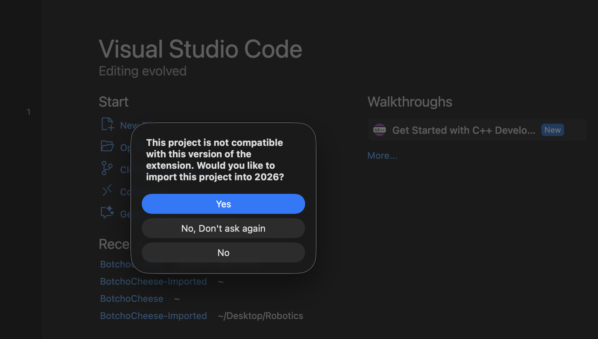
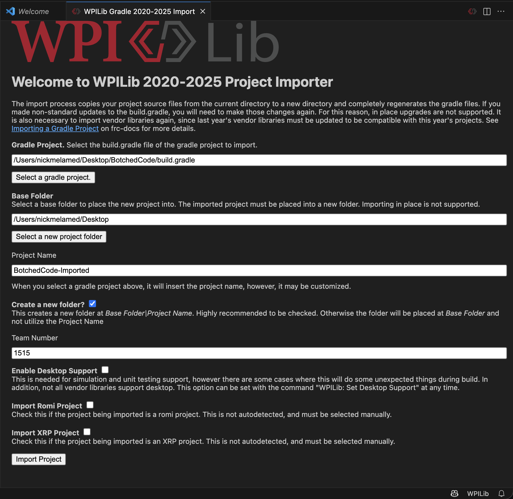
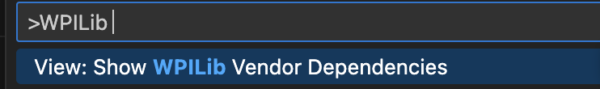
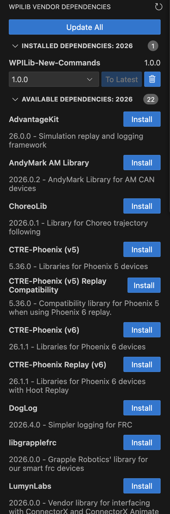

# How to Handle Dependencies for New Competitions 

## Downloading the WPILib Tools 

To access the provided codebase for FRC, find the WRC Installation Guide. For 2026, that page is [here](https://docs.wpilib.org/en/stable/docs/zero-to-robot/step-2/wpilib-setup.html). 

Simply follow the directions provided. **Make sure to select Everything** for your install mode. This will make sure you have WPILib and any other tools needed. 

## Getting your Remote Repository on your Local Computer 

Once you have VS Code set up, you need to clone your repository to make sure it is available to run. Run `git clone <url>` in your terminal, where the URL is the code line you can copy from the remote GitHub page containing the repository. 

## Updating the Repository  

Once you have the local repo folder, you will open it in VSCode. Once you open it, the VSCode will prompt you with this image: 

Click yes, and it will lead you to this page: 

Here, just follow along with this checklist as shown. It will create a duplicate of the repository. 

However, you must then do this command to move the `.git` file from our original repository to this imported one. This is because WPILib just creates a copy of the directory, but excludes anything that actually makes the directory a repository. 

Run this command to fix this problem: `cp -R ./BotchedCode/.git ./BotchedCode-Imported`. Note this assumes that you are in the directory that contains both the old and imported repos. 

Once you perform this command, your `-Imported` repo is now all set to be pushed remotely. It is important to note that if you run `git status` for the imported repository, you will see a ton of modified or deleted files. It is important that you allow this to happen, and run this sequence of commands: 

```bash
git add .
git commit -m "<commit message>"
git push
```

Remember, you can always copy and paste any of the old files into this new repository and push those files as needed. 

Once you have done this, you can finally work with updating dependencies. 

## Updating Dependencies 

With the repo finally set up, your build command will likely not work. This is because the outdated dependency files are still here. Fortunately, WPILib has some functionality to support doing this automatically (which is much better than going through these one by one).

You can click on this button to open up the command palette for WPILib commands: 

Once you click on this, type in for this command: 

Then, you will get an option for your dependencies on the left hand side. You want to click on the current year dependencies (for this project, 2026), and then select "update all" in this sidebar: 

Once you do this, your code should be ready to build! 

Happy programming! 


